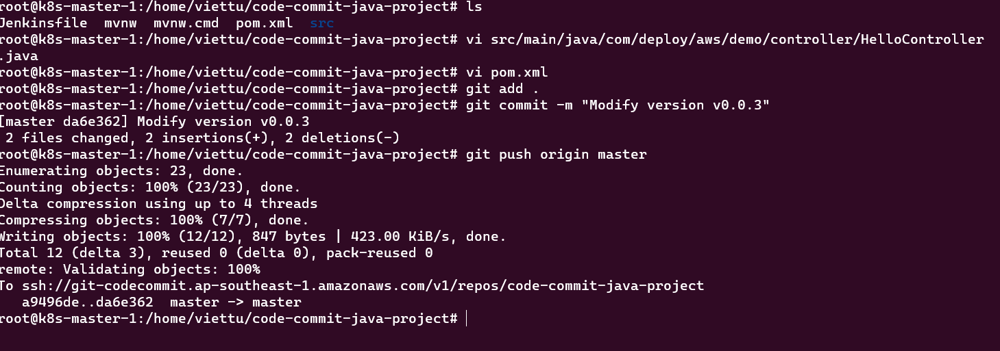
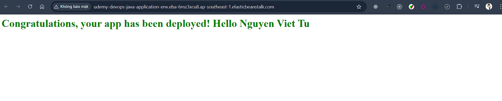
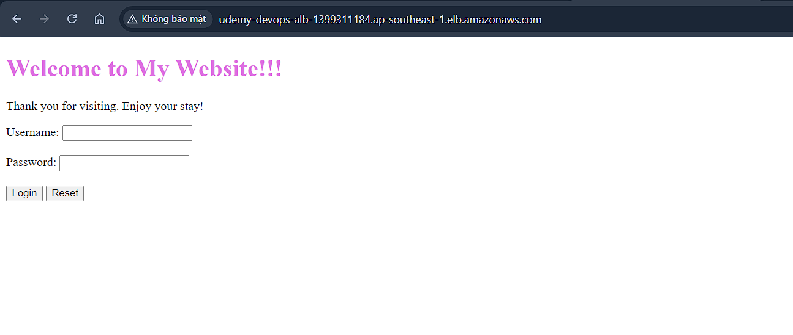
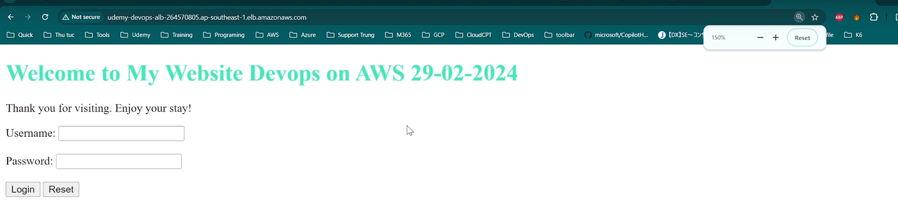
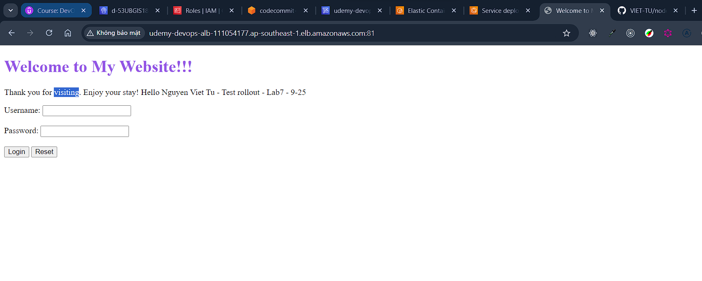
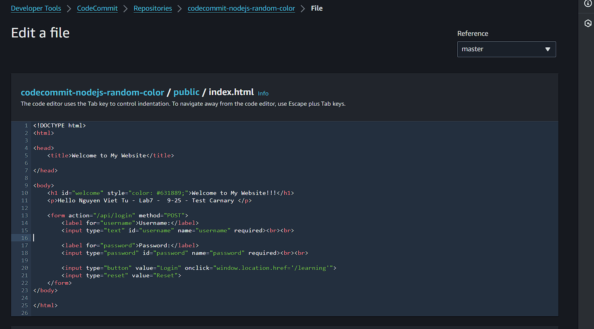
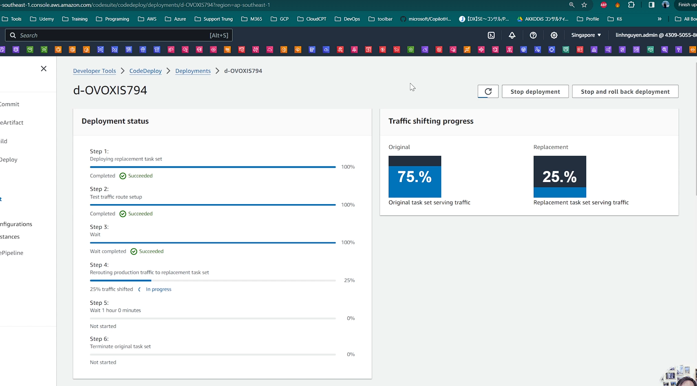

# Về việc CODECOMMIT NGỪNG HOẠT ĐỘNG

Về việc AWS CodeCommit ngừng hoạt động.

Tháng 7-2024, AWS đã chính thức ngừng hỗ trợ cho dịch vụ CodeCommit. Các khách hàng mới (Account tạo sau ngày 25/7) sẽ không thể access dịch vụ này, mình vừa thử vào ngày 8/8 thì vẫn tạo repository được bình thường (do account mình tạo đã lâu) tuy nhiên sẽ có thông báo như bên dưới kèm hướng dẫn migrate sang Github hoặc Gitlab...

Hướng dẫn migrate sang provider khác:

https://aws.amazon.com/blogs/devops/how-to-migrate-your-aws-codecommit-repository-to-another-git-provider/

Mình đã record thêm một phiên bản cho các bài Lab 2,3,4 sử dụng Github làm provider tuy nhiên các bạn có thể workaround bằng một trong các cách sau:

Sử dụng một tài khoản được tạo trước 25/7/2024 để thực hành (có thể tạo CodeCommit repo).

Vẫn làm bài lab như bình thường nhưng ở bước source trong pipeline, thay vì chọn CodeCommit, các bạn chọn nguồn là Github giúp mình. Nhấn nút Connect to Github để cấp quyền cho CodeBuild có thể checkout code từ Github.

Xem video sd CodeCommit để tham khảo và làm theo video sd phương án Github.

# Target

• Giới thiệu về CodeCommit , CodeBuild, CodeDeploy, CodePipeline.
• Sử dụng CodeCommit để lưu trữ và quản lý source code.
• Sử dụng CodeBuild để build một số project vd Java, Nodejs, Docker.
• Sử dụng CodeDeploy để deploy lên ElasticBeanstalk và ECS.
• Kết hợp tất cả trong CodePipeline để tạo thành flow CICD hoàn chỉnh.

# Giới thiệu CodeCommit

- CodeCommit là một dịch vụ được quản lý bởi AWS, giúp bạn lưu trữ và quản lý source code, cấu hình và các tài liệu liên quan trong một kho lưu trữ Git an toàn, riêng tư và có thể mở rộng.
- Một số tính năng chính của AWS CodeCommit bao gồm:
  • Quản lý mã nguồn: CodeCommit cung cấp một kho lưu trữ Git, cho phép bạn lưu trữ và quản lý mã nguồn, cấu hình và tài liệu.
  • Bảo mật: CodeCommit mã hóa các tệp và metadata của bạn tại atres và trong quá trình transfer.
  • Tích hợp với các dịch vụ AWS khác: CodeCommit có thể tích hợp với các dịch vụ AWS khác như CodeBuild, CodeDeploy và CodePipeline để tự động hóa quy trình phát triển phần mềm.
  • Có thể mở rộng: CodeCommit có thể mở rộng để hỗ trợ dự án từ nhỏ đến lớn, từ một vài người dùng đến hàng trăm người dùng.
  • Quản lý truy cập: Tích hợp trực tiếp với IAM để quản lý truy cập, setting các policy.

# Giới thiệu CodeBuild

- CodeBuild là một dịch vụ xây dựng và kiểm thử từ AWS giúp bạn biên dịch mã nguồn, chạy kiểm thử và tạo ra các software package mà có thể được triển khai.
- Dịch vụ này hoạt động dựa trên cấu hình mà bạn cung cấp dưới dạng file 'buildspec' hoặc thông qua một Dockerfile từ source code.
- Một số tính năng chính của AWS CodeBuild bao gồm:
  • Tự động hóa
  • Có thể mở rộng: CodeBuild có thể mở rộng để xử lý các công việc xây dựng lớn và đồng thời xử lý nhiều công việc xây dựng cùng lúc.
  • Tích hợp với các dịch vụ AWS khác như CodeCommit, CodeDeploy và CodePipeline để tự động hóa quy trình phát triển phần mềm.
  • Bảo mật: CodeBuild chạy trong một VPC riêng, giúp bảo vệ môi trường build của bạn.
  • Hiệu quả chi phí: Với CodeBuild, bạn chỉ phải trả cho thời gian build thực tế mà bạn sử dụng.

# Giới thiệu CodeDeploy

- CodeDeploy là một dịch vụ triển khai tự động từ AWS giúp bạn tự động hóa việc triển khai ứng dụng vào các môi trường dịch vụ như EC2, ECS, AWS Lambda, và cả máy chủ vật lý của bạn. (máy chủ on permis)
- Một số tính năng chính của CodeDeploy bao gồm:
  • Triển khai tự động: giúp giảm thời gian downtime và tăng tốc độ triển khai.
  • Triển khai môi trường phức tạp: CodeDeploy hỗ trợ triển khai vào các môi trường dịch vụ phức tạp và cung cấp khả năng quản lý cấu hình, điều khiển phiên bản và quản lý trạng thái ứng dụng.
  • Tích hợp với các dịch vụ AWS khác: như CodeCommit, CodeBuild và AWS CodePipeline để tự động hóa quy trình phát triển phần mềm. (codecommit chính source sau codebuild ra các artifact và codedeploy sẽ dùng các artifact đó để triển khai lên các target và 3 thằng đó lắm dưới sự chỉ đạo của codepipeline)
  • Quản lý chi phí: Với CodeDeploy, bạn chỉ phải trả cho những gì bạn sử dụng. Không cần trả trước và bạn có thể bắt đầu sử dụng CodeDeploy miễn phí.
  • Cập nhật liên tục: CodeDeploy hỗ trợ cập nhật liên tục, giúp bạn triển khai các phiên bản mới của ứng dụng một cách nhanh chóng và dễ dàng.

# Giới thiệu CodePipeline

- CodePipeline là một dịch vụ triển khai tự động từ Amazon Web Services giúp bạn tự động hóa các bước trong quy trình phát triển phần mềm. Nó cho phép bạn xác định một chuỗi các bước, gọi là "pipeline", mà mỗi bước sẽ được thực hiện mỗi khi có thay đổi code. Các bước này có thể bao gồm việc build code, kiểm tra và triển khai ứng dụng.
- Ví dụ, bạn có thể thiết lập một pipeline với các bước sau:
  • Khi có thay đổi code trong kho lưu trữ Git, AWS CodePipeline sẽ tự động chạy.
  • Code sẽ được build bằng cách sử dụng một công cụ build như AWS CodeBuild.
  • Sau khi build thành công, các kiểm tra tự động sẽ được chạy để đảm bảo chất lượng code.
  • Nếu tất cả các kiểm tra đều thành công, code sẽ được triển khai lên một môi trường như Elastic Beanstalk hoặc Fargate (ECS).
  • Với CodePipeline, bạn có thể tự động hóa quy trình phát triển phần mềm, giúp giảm thời gian triển khai và tăng cường chất lượng sản phẩm.

# Lab1 – Sử dụng CodeComit làm repository quản lý source code

Yêu cầu:
• Tạo một repository trên CodeCommit
(Code commit => create repository => name: "code-commit-java-project" => create)
• Tạo một credential cho code commit (dạng username/password hoặc SSH).
\*Xem lại bài lab CodeCommit trong chương thao tác cơ bản với Git.
• Checkout source code, modify, push.

```bash
git clone ssh://git-codecommit.ap-southeast-1.amazonaws.com/v1/repos/code-commit-java-project
```

# Lab2 - Tạo một Job CodeBuild đơn giản (Java project)

```bash
#Step1: Tạo một repository trên CodeCommit
#Tên repo:
codecommit-java-project
#Cấu hình SSH key hoặc username/password để push code lên repo.
#Thử checkout code từ CodeCommit.

#Step2: Chuẩn bị source code.
#Checkout repo sau:
https://github.com/hoanglinhdigital/java-elasticbeanstalk-sample
#Copy vào trong thư mục CodeCommit project, modify nếu cần, push lên CodeCommit repository của bạn.

git clone https://github.com/hoanglinhdigital/java-elasticbeanstalk-sample
cd java-elasticbeanstalk-sample/
rm -rf .git/
mv * ../code-commit-java-project/
cd code-commit-java-project/
git add .
git commit -m "Init repo Java"
git push origin master

#Step3: tạo một S3 bucket để chứa artifact. Ví dụ:
udemy-devops-codebuild-viettu

#Step4: Tạo một Job trong CodeBuild
#Tên job:
udemy-devops-java-project-build

#Chọn Source: CodeCommit, chọn repo:
codecommit-java-project
#Chọn Environment:
#  - Managed image, OS: Ubuntu,
#  - Runtime: Standard
#  - Image: aws/codebuild/standard:7.0
#  - Image Version: Always use latest image for runtime version

#Chọn Service role: Create a service role in your account

#Buildspec
#Chọn Insert Build Command
#Code: tham khảo file buildspec.yml trong thư mục cùng cấp với file này.
#Tham khảo: danh sách runtime được codebuild hỗ trợ: https://docs.aws.amazon.com/codebuild/latest/userguide/runtime-versions.html

#Artifacts
#Chọn Type: Amazon S3,
#  - Bucket name: <Tên bucket đã được các bạn tạo ra trước đó>
#  - Name: demo_java_artifact
#  - Path: <để trống>
#  - Namespace type: None
#  - Artifacts packaging: None

#Aditional configuration: để mặc định.
#Chọn CloudWatch logs: Create a new log group
#Save job lại.

```

Yêu cầu:
• Tạo một Job trong CodeBuild có nhiệm vụ checkout một Java project (từ CodeCommit).
(Code build => create project => name: "udemy-devops-java-project-build" => Source 1 - Primary -> Source provider: AWS codecommit -> repository: "code-commit-java-project" => Environment -> Provisioning model: "On-demand" -> Environment image: "Managed image" -> Compute: EC2 -> Operating system: Ubuntu -> Runtime(s): Standard -> Image: "aws/codebuild/standard:7.0" -> Image Version: Always use latest image for runtime version -> role name: "codebuild-udemy-devops-java-project-build-service-role" => Buildspec -> Build specifications: Insert build commands -> pate buildspce.yml vô => Artifacts -> type: S3 -> Bucket name: "udemy-devops-codebuild-viettu" -> name: "demo_java_artifact" -> path: trống -> Namespace type: None -> Artifacts packaging: None (tức là build ra cái j nó đẩy luôn lên cái đó) => Logs -> tích CloudWatch logs => create build project )


build spec 
 [ https://docs.aws.amazon.com/codebuild/latest/userguide/runtime-versions.html]
• Build

(Start build)

• Push artifact lên S3.


## Lab 2 sử dụng Github

```bash
# ===Yêu cầu===
# Tạo một Job trong CodeBuild có nhiệm vụ checkout một Java project (từ Github).
# Build
# Push artifact lên S3.

#Step1: Đăng nhập thành công vào Github, cấu hình SSH key để checkout source code nếu cần.
#*Tham khảo lại chương Thao tác cơ bản với Git.

#Step2: Fork repository sau với một tên mới
https://github.com/hoanglinhdigital/java-elasticbeanstalk-sample
#Tên repo vd:
java-elasticbeanstalk-sample-yyyymmdd

#Step3: tạo một S3 bucket để chứa artifact. Ví dụ:
udemy-devops-codebuild-viettu

#Step4: Tạo một Build Project trong CodeBuild
#Tên job:
udemy-devops-java-project-build-02

#Chọn Source: Github, nhấn nút Connect to Github, sẽ mở ra một popup yêu cầu login vào Github và cấp quyền cho CodeBuild.
# Bấm vào Manage default source credential => chọn Ouathor => next => next

#Sau khi login thành công, quay trở lại màn hình CodeBuild, chọn repository:
java-elasticbeanstalk-sample-yyyymmdd
#Branch chọn "master"

#Chọn Environment:
  - Managed image, OS: Ubuntu,
  - Runtime: Standard
  - Image: aws/codebuild/standard:7.0
  - Image Version: Always use latest image for runtime version

#Chọn Service role: Create a service role in your account
udemy-devops-codebuild-role

#Buildspec
#Chọn Insert Build Command
#Code: tham khảo file "buildspec.yml" trong thư mục cùng cấp với file này.
#Tham khảo: danh sách runtime được codebuild hỗ trợ: https://docs.aws.amazon.com/codebuild/latest/userguide/runtime-versions.html

#Artifacts
#Chọn Type: Amazon S3,
#  - Bucket name: <Tên bucket đã được các bạn tạo ra trước đó>
#  - Name: demo_java_artifact
#  - Path: <để trống>
#  - Namespace type: None
#  - Artifacts packaging: None

#Aditional configuration: để mặc định.
#Chọn CloudWatch logs: Create a new log group
#Save job lại.

#Step5: Chạy CodeBuild job và kiểm tra kết quả.

#====Troubleshooting lỗi permission nếu có.
#Nếu bị lỗi không tạo được cloudwatch Log, không pull được code hoặc acces S3, các bạn thêm các policy sau vào role của CodeBuild service role.
AmazonS3FullAccess
CloudWatchFullAccessV2
CloudWatchLogsFullAccess
```

# Lab3 - Tạo một Job CodeBuild đơn giản (Nodejs project)

```bash
# Yêu cầu:
# Tạo một Job trong CodeBuild có nhiệm vụ checkout một Nodejs project (từ CodeCommit).
# Build
# Push artifact lên S3.

#Step1: Tạo một repository trên CodeCommit
#Tên repo:
codecommit-nodejs-webpack
#Cấu hình SSH key hoặc username/password để push code lên repo.
#Thử checkout code từ CodeCommit.

#Step2: Chuẩn bị source code.
#Checkout repo sau (Nodejs + Webpack):
https://github.com/hoanglinhdigital/simple-vue-webpack.git
#Copy vào trong thư mục CodeCommit project, modify nếu cần, push lên CodeCommit repository của bạn.

#Step3: tạo một S3 bucket để chứa artifact. Ví dụ:
udemy-devops-codebuild-viettu

#Step4: Tạo một Job trong CodeBuild
#Tên job:
udemy-devops-nodejs-project-build

#Chọn Source: CodeCommit, chọn repo:
codecommit-nodejs-webpack
#Branch: chọn "main"

#Chọn Environment:
#  - Managed image, OS: Amazon Linux
#  - Runtime: Standard
#  - Image: aws/codebuild/amazonlinux2-x86_64-standard:5.0
#  - Image Version: Always use latest image...

#Chọn Service role: Create a service role in your account (Hoặc chọn lại role ở bài lab2)

#Buildspec
#Chọn Insert Build Command
#Code: tham khảo file buildspec.yml trong thư mục cùng cấp với file này.
#  - Dòng 20: thay thế tên bucket của bạn.

#Tham khảo: danh sách runtime được codebuild hỗ trợ: https://docs.aws.amazon.com/codebuild/latest/userguide/runtime-versions.html

#Chọn Artifacts: chọn No Artifacts *Lý do: Sẽ sử dụng command để upload trực tiếp lên S3.

#Aditional configuration: để mặc định.
#Chọn CloudWatch logs: Create a new log group
#Save job lại.

#Step5: Chạy job và kiểm tra kết quả.

#Troubleshooting lỗi permission nếu có.
#Nếu bị lỗi không tạo được cloudwatch Log, không pull được code hoặc acces S3, các bạn thêm các policy sau vào role của CodeBuild service role.
AmazonS3FullAccess
AWSCodeCommitFullAccess
CloudWatchFullAccessV2
CloudWatchLogsFullAccess
```

(tạo repo "codecommit-nodejs-webpack" trên codecommit và push code)
Yêu cầu:
• Tạo một Job trong CodeBuild có nhiệm vụ checkout một Nodejs project (từ CodeCommit).
(Codebuild => create project => name: "udemy-devops-nodejs-project-build" => Source provider: Codecommit -> repo: "codecommit-nodejs-webpack" -> Reference type: Branch -> branch: master => Environment -> Operating system: Linux -> runtime: stander -> Image: aws/codebuild/amazonlinux2-x86_64-standard:5.0 -> Image Version: Always use latest image... -> Service role: exit role bài lab2 chú ý bổ sung thêm S3FullAccess=> Buildspec -> Switch to editor -> dán buildspec.yml => Artifacts -> type: No Artifacts (\*Lý do: Sẽ sử dụng command để upload trực tiếp lên S3.) => create build project => start Build )

• Install dependencies sử dụng lệnh: npm install
• Build static file sử dụng lệnh: npm run build
• Push artifact lên S3 (file tĩnh) sử dụng câu lệnh aws s3 cp

# Lab3 - Tạo một Job CodeBuild đơn giản (Nodejs project) - Version Github

```bash
# Yêu cầu:
# Tạo một Job trong CodeBuild có nhiệm vụ checkout một Nodejs project (từ Github).
# Build
# Push artifact lên S3.

#Step1: Đăng nhập thành công vào Github, cấu hình SSH key để checkout source code nếu cần.
#*Tham khảo lại chương Thao tác cơ bản với Git.

#Step2: Fork repository sau với một tên mới
https://github.com/hoanglinhdigital/simple-vue-webpack
#Tên repo vd:
simple-vue-webpack-yyyymmdd

#Step3: tạo một S3 bucket để chứa artifact (bỏ qua nếu đã tạo trong bài lab trước). Ví dụ:
udemy-devops-codebuild-viettu

#Step4: Tạo một Job trong CodeBuild
#Tên job:
udemy-devops-nodejs-project-build-02

#Chọn repository (các bạn đã làm bài lab2 không cần login lại với Github)
#Chọn Source: Github, nhấn nút Connect to Github, sẽ mở ra một popup yêu cầu login vào Github và cấp quyền cho CodeBuild.
#Sau khi login thành công, quay trở lại màn hình CodeBuild, chọn repository:

simple-vue-webpack
#Branch: chọn "main" (Source version - optional) ### Chú ý

#Chọn Environment:
#  - Managed image, OS: Amazon Linux
#  - Runtime: Standard
#  - Image: aws/codebuild/amazonlinux2-x86_64-standard:5.0
#  - Image Version: Always use latest image...

#Chọn Service role: Create a service role in your account (Hoặc chọn lại role ở bài lab2)

#Buildspec
#Chọn Insert Build Command (nếu như có file buildspec.yml trong sẵn sourc code thì chọn Use a buildspec file )
#Code: tham khảo file "buildspec.yml" trong thư mục cùng cấp với file này.
#  - Dòng số 20: thay thế s3 bucket bằng tên s3 bucket của bạn.

#Tham khảo: danh sách runtime được codebuild hỗ trợ: https://docs.aws.amazon.com/codebuild/latest/userguide/runtime-versions.html

#Chọn Artifacts: chọn No Artifacts *Lý do: Sẽ sử dụng AWS CLI để upload trực tiếp lên S3.

#Aditional configuration: để mặc định.
#Chọn CloudWatch logs: Create a new log group
#Save job lại.

#Step5: Chạy job và kiểm tra kết quả.

#Troubleshooting lỗi permission nếu có.
#Nếu bị lỗi không tạo được cloudwatch Log, không pull được code hoặc acces S3, các bạn thêm các policy sau vào role của CodeBuild service role.
AmazonS3FullAccess
CloudWatchFullAccessV2
CloudWatchLogsFullAccess
```


bỏ tích 

# Lab4 - Tạo một Job CodeBuild đơn giản (Docker)

```bash
Chi tiết file lab4.sh
```

(codecomit => create repository => name: "codecommit-nodejs-random-color" => create => push code)
(tạo một ECR Repository để chứa docker image. Ví dụ:)
( Secrets Manager => Store a new secret => Secret type: Other type of secret => Key/value pairs: Plaintext ->"viettu123" => name: "dockerhub-username-secret" => next => store ) => TT cho dockerhub-password-secret


Yêu cầu:
• Tạo một ECR Repository
• Tạo một Job trong CodeBuild có nhiệm vụ checkout một Nodejs project
(từ CodeCommit).
(Codebuild => name: "udemy-devops-nodejs-docker-build" => Source 1 -> Codecomit -> repo: "codecommit-nodejs-random-color" => system: ubuntu -> Runtime(s): Standard -> Image: aws/codebuild/standard:5.0 -> mage Version: Always use latest image... -> role: exit role => Buildspec: Insert build commands -> paste vô => Artifacts: No Artifacts => `Additional configuration` -> tick vào "Enable this flag if you want to build Docker images or want your builds to get elevated privileges" (có quyền chạy các lệnh trong để build docker) => create)
(udemy-devops-nodejs-docker-build => Action => Edit permision => add permision: AmazonEC2ContainerRegistryFullAccess , SecretsManagerReadWrite => add permision )
• Build thành Docker image
(Start Build)
• Push artifact lên ECR Repository.

# Lab4 - Tạo một Job CodeBuild đơn giản (Docker) - Github version

```bash
# Yêu cầu:
# Tạo một Job trong CodeBuild có nhiệm vụ checkout một Nodejs project (từ Github).
# Build
# Push artifact lên S3.

#Step1: Đăng nhập thành công vào Github, cấu hình SSH key để checkout source code nếu cần.
#*Tham khảo lại chương Thao tác cơ bản với Git.

#Step2: Fork repository sau với một tên mới
https://github.com/hoanglinhdigital/nodejs-random-color
#Tên repo vd:
nodejs-random-color-yyyymmdd

#===Step3===
#tạo một ECR Repository để chứa docker image. Ví dụ:
nodejs-random-color

#===Step4=== Chuẩn bị một account DockerHub.
#Tạo 2 secret manager để lưu username/password của DockerHub. Type: Plaintext
#Tên của secret (LƯU Ý không đổi tên):
dockerhub-username-secret
dockerhub-password-secret

#===Step5=== Tạo một Job trong CodeBuild
#Tên job:
udemy-devops-nodejs-docker-build

#Chọn repository (các bạn đã làm bài lab2 không cần login lại với Github)
#Chọn Source: Github, nhấn nút Connect to Github, sẽ mở ra một popup yêu cầu login vào Github và cấp quyền cho CodeBuild.
#Sau khi login thành công, quay trở lại màn hình CodeBuild, chọn repository:
nodejs-random-color-yyyymmdd
#Branch: chọn "main" (Chú ý - Source version - optional )

#Chọn Environment:
#  - Managed image, OS: Ubuntu
#  - Runtime: Standard
#  - Image: aws/codebuild/standard:5.0
#  - Image Version: Always use latest image...

#Chọn Service role: Create a service role in your account (*Hoặc sử dụng lại role của bài lab 2).

#Buildspec
#Chọn Insert Build Command
#Code: tham khảo file buildspec.yml trong thư mục cùng cấp với file này.
#Tham khảo: danh sách runtime được codebuild hỗ trợ: https://docs.aws.amazon.com/codebuild/latest/userguide/runtime-versions.html
#  - Dòng 13: Thay lệnh login bằng lệnh lấy từ ECR.
#  - Dòng 14 chỗ REPOSITORY_URI -> thay thế ECR repository của bạn vào.

#Chọn Artifacts: chọn No Artifacts *Lý do: Sẽ sử dụng command để push image trực tiếp lên ECR.


#Click vào: Additional configuration
#Chỗ: Privileged, tick vào "Enable this flag if you want to build Docker images or want your builds to get elevated privileges"

#Chọn CloudWatch logs: Create a new log group
#Save job lại.

#===Step6===
#Add policy vào role của CodeBuild service role, để cho phép CodeBuild push image lên ECR và đọc secret manager.
AmazonEC2ContainerRegistryFullAccess
SecretsManagerReadWrite

#===Step7=== Chạy job và kiểm tra kết quả.
#Expect: Image được push lên ECR thành công.

#================================================================================================
#Troubleshooting lỗi permission nếu có.
#Nếu bị một trong các lỗi không access được: Cloudwatch Log, ECR, S3, SecretManager, các bạn thêm các policy sau vào role của CodeBuild service role.
AmazonS3FullAccess
AWSGithubFullAccess
CloudWatchFullAccessV2
CloudWatchLogsFullAccess
ElasticContainerRegistryFullAccess
SecretsManagerReadWrite

#Troubleshooting lỗi: toomanyrequests: You have reached your pull rate limit. You may increase the limit by authenticating and upgrading: https://www.docker.com/increase-rate-limit
#Cách fix: thêm lệnh login vào DockerHub vào trước lệnh build image.

```

# Lab5 - Tạo một CodePipeline đơn giản – Deploy lên Elastic Beanstalk


Yêu cầu:
\*Sử dụng lại output của bài lab CodeBuild – Java project. (lab2)
• Tạo một Elastic Beanstalk Application+environment chạy Java, sử dụng file .jar của bài lab 2. Kiểm tra application chạy thành công.
(ELB => create: "udemy-devops-java-application" => crate => create envirmont => tier: Web server enviroment => Platform: Java -> branch: Correcto 17 Linux 2023 -> platform version: 4.3.0 => application code -> upload your code -> version label: v0.0.2 -> public s3 Url: "https://udemy-devops-codebuild-viettu.s3.ap-southeast-1.amazonaws.com/demo_java_artifact/demo-v0.0.2.jar" => presets: Single instance => next => Service role: create and use new service role -> name: "aws-elasticbeanstalk-service-role-2702" -> keypar: "singapor-key" -> EC2 instance profile: "ec2-beanstalk-web-role" (Role dưới dành cho `instance`, role trên dành cho `Service`) => next => vpc: default -> không cần tích Activated (public ipv4) -> subnet: chọn tối đa => sg: default => Auto scaling groupo: Single instance => next => Monitoring -> Health reporting: Basic (cho đỡ tốn tiền) => Managed platform update: disable Ativated => Application deployment: để default hết => next => submit )


• Tạo một pipeline trong CodePipeline có nhiệm vụ trigger job CodeBuild sau đó deploy artifact lên Elastic Beanstalk theo hình thức All-At-One.
(Codepipeline => create pipeline => name: "java-beanstalk-cicd-pipeline" => Pipeline type chọn: V2 => Execution mode: Superseded (ví dụ ta đang chạy một job 1 , và chạy tiếp job lần thứ 2 thì nó sẽ dừng job đầu tiên, Queue: tuần tự, đang có một job chạy mà chạy job thứ 2 nó sẽ chờ job đầu tiên chạy xong, Parallel: chạy song song, không có quy tắc) => Service role: New service role ->name: "AWSCodePipeline-java-1-java-beanstalk-cicd-role" -> tích: "Allow AWS CodePipeline to create a service role ..." (để tạo ra các service role) => next => Source -> Source provider: Codecommit -> Repository name: "code-commit-java-project" => branch: "master" => Change detection options: Amazon CloudWatch Events => Output artifact format: CodePipeline default => Build provider: AWS CodeBuild => Project name: "udemy-devops-java-project-build" => Build type: Single build => Deploy provider: ElaticBeanstalk ->Application name: "udemy-devops-java-application" => next => create pipeline )
(khi tạo pipline nó sẽ chạy lần đầu tiên luôn, kéo source code, Build và Deploy)  
(kiểm tra elaticbeastak thấy nó build lại lần nữa) 
• Modify code, push, kiểm tra pipeline được trigger tự động.
(Sửa source java, sửa file pom.xml và HelloController.java, rồi push lên codecomit)

Lúc này codepline tự động trigger khi có code mới đẩy lên codecommit

`Bước stage deploy cái thực sự phụ trách deploy là Elastic Beanstalk không phải là codedeploy`

Kiểm tra ai code lên và sửa những gì


• Kiểm tra ElasticBeanstalk environment được triển khai version mới.
Elasticbeastalk sẽ được update version mới

• Truy cập thử.


==> Việc deploy như vậy có downtime, vì vậy có thể sử dụng chiến lược bule-green

# Lab6 - Tạo một CodePipeline– Deploy lên ECS sử dụng `Rollout`


\*Sử dụng lại output của bài lab 4 (docker image trên ECR repository)

• Triển khai một cluster ECS sử dụng Terraform cho sẵn. Truy cập thử.

• Modify job CodeBuild của bài lab4, thêm bước tạo file Json definition. (json definition là để mỗi lần build xog ta tạo 1 cái file task definition, nó chính là cơ chế để cho ecs cần phải launch task như thế nào)

```bash
# Quy Trình Sử Dụng
# Khi bạn sử dụng AWS CodePipeline cho CI/CD, quy trình thường diễn ra như sau:

#1. Build Application:
# Bạn build ứng dụng và tạo một Docker image mới, sau đó đẩy image này lên Amazon ECR.

#2.  Generate imagedefinitions.json:
# Một tập lệnh CI/CD sẽ chạy để tạo ra tệp imagedefinitions.json giống như lệnh bạn cung cấp.
# Tệp này chỉ định rõ ràng URI của Docker image và phiên bản (thường là commit hash) mà bạn muốn ECS service sử dụng.

#3.  Deploy Using CodeDeploy:
# AWS CodeDeploy hoặc AWS CLI sử dụng imagedefinitions.json để cập nhật hoặc triển khai ECS service với image mới.
# Ví Dụ Sử Dụng Với AWS CLI
# Bạn có thể triển khai một ECS service với lệnh sau, sử dụng tệp imagedefinitions.json:
aws ecs update-service --cluster my-cluster --service my-service --force-new-deployment --cli-input-json file://imagedefinitions.json

```

(Dựa vào sơ đồ ta có thể thấy là artifact ở stage build sẽ là input cho stage deploy)
(Codebuild => udemy-devops-nodejs-docker-build => edit => Build commands: dán code mới của file lab6-codepipline-docker-ecs => update project) => start Build để kiểm tra có build ok không

• Tạo một pipeline trong CodePipeline có nhiệm vụ trigger job CodeBuild build ra ECR image sau đó deploy Docker lên ECS `theo hình thức rollout.`

**Lưu ý:** (`file imagedefinitions.json ở stage build sẽ là input cho stage deploy có yếu tố đó mới deploy được`)
(Codepipeline => create pipeline => name: "udemy-devops-deploy-ecs-pipeline-rollout" => next => Add deploy stage -> Deploy provider: Amazon ECS -> Cluster name: "udemy-devops-ecs-cluster" -> Service name: "nodejs-service" -> Image definitions: "imagedefinitions.json" (
Enter the JSON file that describes your service's container name and the image and tag.) => next => create pipeline ) => Sau khi tạo pipeline thì nó sẽ chạy pipeline lần đầu tiên


Kết quả:
 màu đỏ thay vì màu xanh
• Modify code, push, kiểm tra pipeline được trigger tự động.
(Sửa file index.html)


• Kiểm tra ECS Service được triển khai version mới.
(khi push code lên codecommit codepline sẽ được trigger và chạy các tác vụ)
• Kiểm tra và truy cập thông qua ALB => new version.


```bash

[Container] 2024/08/31 11:09:44.948715 Running command printf '[{"name":"nodejs-container","imageUri":"%s"}]' $REPOSITORY_URI:$COMMIT_HASH > imagedefinitions.json

[Container] 2024/08/31 11:09:44.954109 Running command cat imagedefinitions.json
[{"name":"nodejs-container","imageUri":"287925497349.dkr.ecr.ap-southeast-1.amazonaws.com/codebuild-nodejs-random-color:a337401"}]
```

# Lab7 - Tạo một CodePipeline – Deploy lên ECS sử dụng Blue-Green

```bash
#Tham khảo ECS Deployment Controller: https://docs.aws.amazon.com/AmazonECS/latest/APIReference/API_DeploymentController.html

# Amazon ECS cung cấp ba loại "Deployment Controller" khác nhau, mỗi loại có cách hoạt động riêng:

# ECS (Rolling Update) (Mặc định của ECS nếu không sử dụng service bên ngoài)

# Cách hoạt động: Loại này thay thế các container hiện tại với phiên bản mới theo từng đợt (rolling update). Ví dụ, khi bạn cập nhật một service, ECS sẽ tạo ra một số container mới với phiên bản mới, đồng thời dừng một số container cũ, quá trình này diễn ra liên tục cho đến khi tất cả các container cũ được thay thế hoàn toàn.
# Khi nào sử dụng: Phù hợp khi bạn muốn quá trình cập nhật diễn ra từ từ, giảm thiểu rủi ro gây gián đoạn dịch vụ.

# CODE_DEPLOY (Blue/Green Deployment) (yêu cầu có 2 target group)

# Cách hoạt động: Loại này sử dụng mô hình "blue/green" để triển khai. Tức là một nhóm container (blue) hiện đang phục vụ sản xuất sẽ tiếp tục hoạt động trong khi một nhóm container mới (green) được tạo ra. Bạn có thể kiểm tra nhóm "green" này trước khi chuyển toàn bộ lưu lượng truy cập từ nhóm "blue" sang nhóm "green".
# Khi nào sử dụng: Phù hợp khi bạn cần kiểm tra phiên bản mới một cách kỹ lưỡng trước khi chuyển sang sử dụng chính thức, giúp giảm thiểu rủi ro.

# EXTERNAL (Third-Party Controller)

# Cách hoạt động: Với loại này, bạn có thể sử dụng bất kỳ controller của bên thứ ba nào để kiểm soát quá trình triển khai hoàn toàn. Điều này cho phép bạn tùy chỉnh quá trình triển khai theo ý muốn.
# Khi nào sử dụng: Phù hợp khi bạn có yêu cầu triển khai phức tạp hoặc đặc thù mà hai loại ECS và CODE_DEPLOY không đáp ứng được.
```

==> Muốn deploy theo kiểu blue-green thì service trong cluster đó phải được cấu hình theo Mode: CODE_DEPLOY
(Ta sẽ cần 2 target group, một target group 01 và 02 trong quá trình deploy nó sẽ deploy service mới lên và end user chưa access được ngay vì vẫn sử dụng code cũ và test ok hết lúc này nó swith traffic giữa 2 group và alb sẽ trỏ sang group chứa code mới tương tự như chiến lược deployment khi sử dụng jenkins tuy nhiên ở đây có sự can thiệp của CodeDeploy lên mọi thứ sẽ đơn giản hơn nhiều, không phải sử dụng câu lệnh codeploy nó tự làm)
`Hình thức Blue-Green trong bài lab này apply ở cấp độ serivce chứ không phải cluster` và bổ sung thêm thành phần s3, trong quá trình deploy build ra một artifact ngoài ECR push image ta cần tạo ra một số file công dụng để codedeploy nó có thể đọc được cấu hình và biết được cần thao tác ECS Service nào

```bash
#Trong bài Lab7 này có 1 số thay đổi với terraform so với bài lab6:
# Module Scurity: mở thêm port 81 cho public scurity group
# Module LoadBlancer: thêm một listener port 81 forward sang target group green và tạo thêm một target group đặt tên một cái blue và green
# Module ECS: thêm deployment_controller thành "CODE_DEPLOY" và  Loadblaner của service trỏ tới target group blue , vậy nên ngay thời điểm start nên thì thằng blue sẽ có service, còn thằng green khi truy cập port 81 thì nó sẽ ra lỗi 503
```

Thêm port 81

Module Loadblancer thêm listener port 81


Module ECS cluster


==> Và register cái service vào target group blue, vậy ngay thời điển start lên thì blue sẽ có service, còn green thì không có

Thay ECR trong file tfvar thành ECR của mình

```bash
terraform init
terraform plan --var-file "terraform.tfvars"
terraform apply --var-file "terraform.tfvars"
terraform destroy --var-file "terraform.tfvars"

```

## Hình minh họa

 (Minh họa Cluster khi start nên không có service số 2)

**Lưu ý**: `Blue-Green trong trường hợp này là service level (không phải cluster level)`

Yêu cầu:
• Modify ECS Service (terraform) chuyển deploymetn controller thành CODE_DEPLOY.
• Thêm 1 target group và 1 listener trên ALB (port 81).
(Khởi chạn terraform)
Port 80: 
Port 81:  sẽ ra lỗi 503, bởi vì chỉ thằng blue có service còn green không có bát kỳ service nào nên nó vô trạng thái 503
• Tạo code_deploy bằng tay

(Follow guid: https://docs.aws.amazon.com/codepipeline/latest/userguide/tutorials-ecs-ecr-codedeploy.html)
(Nhắc lại ECS của ta đang để option `deployment_controller: CODE_DEPLOY` nên ta không thể can thiệp trức tiếp vào Cluster nếu như không có CODE_DEPLOY application, nên nó yêu ta muốn triển khai version mới lên ECS cluter thì bắt buộc phải CODE_DEPLOY, nếu thử update bằng tay service thì nó sẽ văng lỗi bạn đang xét service là code_deploy nên phải dùng code_deploy mới tác động được đến nó )

(CodeDeploy => create application => name: "udemy-devops-deploy-ecs-bluegreen-app" => Compute platform: Amazon ECS => create application)
(udemy-devops-deploy-ecs-bluegreen-app => Deployment groups => create deployment group => name: "udemy-devops-ecs-nodejs-deployment-group" (deploy này chỉ force đến service thôi nên đặt tên service chữ nodejs) => Service role: "udemy-devops-code-deply-role" => ECS cluster name: "udemy-devops-ecs-cluster" => service name: "nodejs-service" => load balancer: "udemy-devops-alb" => Production port: 80 => Test lisener port: 81 (vừa khi Version 2 lên chưa có open cho người dùng, ok thì mới switch) => target group 1 name: "target-group-blue" => target group 2 name: "target-group-green" => Traffic routing: chọn specify when to retoure traffic (vừa triển khai xong chọn khoảng thời gian để test) -> 5 Minutes -> Deployment configuration: CodeDeployDefaultECSAllAtOnce => keep version cũ: 1 Hourse (trong 1 tiếng nếu không bấm rollback thì nó tự biết clear resource version cũ đi không tốn tiền) => Create deployment group )

(Bấm vào Service role ARN => Add thêm role cần thiết)

- AmazonEC2ContainerRegistryFullAccess
- AmazonECS_FullAccess
- AmazonS3FullAccess
- AWSCodeDeployRole
- ElasticLoadBalancingFullAccess (Switch traffic giữa 2 targetgroup)
  

  Modify lại index.html trong source code: nodejs_random_color
  
  ==> Xong chạy lại CodeBuild: chạy lại job udemy-devops-nodejs-docker-build

==> Truy cập task definition của thằng ECS => chọn cái mới nhất => Create new version => Sửa Image URI thành tag mới nhất vừa mới build xong: 287925497349.dkr.ecr.ap-southeast-1.amazonaws.com/codebuild-nodejs-random-color:`c948eac` -> thành tag mới nhất


==> Truy cập vào cluster => Service: nodejs-service => Update Service => Revision: chọn cái 15 vừa mới tạo => Deployment options - Powered by CodeDeploy -> Application name: chọn tên codedeploy => Update

===> Ngay lập tức hành động update service của ta sẽ trigger một cái CodeyDeploy


Có 6 bước:

Step 1: Deploying replacement task set (Triển khai code mới trên cluster)
Step 2: Test traffic route setup (Route traffic sang )
Step 3: Wait 5 hours 0 minutes (Chờ, Blue sẽ trỏ sang code, green sẽ trỏ sang code mới, nhưng lúc này người dùng chưa nhìn thấy code mới test bằng cách vô port 81 để test )


Step 4: Rerouting production traffic to replacement task set (tức là lúc này tg-01 và tg-02 cùng trỏ sang version mới)
Step 5: Wait 1 hour 0 minutes (Nếu bất ổn có thể rollback về)
Step 6: Terminate original task set
==> Bh traffci version cũ vẫn là port 80 còn mới là port 81

==> Ở step 3 bấm route traffic để khỏi phải trờ thì switch traffic sang port 80


==> Nếu ok trong vòng 1 tiếng thì có thểm bấm rollback về version cũ hoặc Terminate origin task


• Tạo một Pipeline trong đó step CodeDeploy sử dụng chiến lược Blue-Green

```bash
#============KẾT HỢP TẤT CẢ TRONG MỘT PIPELINE================
#===Step 1: Modify CodeBuild project
#Tham khảo file: buildspec.yml trong thư mục lab7.
# Mục đích của cập nhật này:
- Thêm file appspec.yml vào artiract output để CodeDeploy có thể deploy tự động trong luồng CICD của CodePipeline.
    - imagedefinitions.json: tạo ra trong quá trình build.
    - imageDetail.json: tạo ra trong quá trình build.
    - appspec.yaml: copy nguyên từ CodeCommit repo trong quá trình build.
    - taskdef.json: copy nguyên từ CodeCommit repo trong quá trình build.

 - imagedefinitions.json
 - appspec.yaml (biết cập nhật cluster nào)
 - imageDetail.json (Cho Codedeploy biết được image nào)
 - taskdef.json (biết phải cập nhật task definition nào)
```

==> Copy file `buildspec.yml` => udemy-devops-nodejs-docker-build => edit => Buidspec: paste toàn bộ `buildspec.yml` => Update project

(Pipeline => Create pipeline => name: "udemy-devops-deploy-ecs-pipeline-blue-green" => pipeline type: V2 => Exits service role: udemy-devops-deploy-ecs-pipeline-rollout-role => next => Source stage -> source provider: AWS CodeCommit -> Repository name: codecommit-nodejs-random-color -> branh name: master -> next => Build stage -> Build provider: AWS CodeBuild -> Project name: udemy-devóp-nodejs-docker-build => next => Deploy stage -> Deploy provider: Amazon ECS (Blue/Green) -> application name: udemy-devops-deploy-ecs-bluegreen-app -> deployment group: udemy-devops-ecs-nodejs-deployment-group -> Amazon ECS task definition: BuildArtifact: `taskdef.json` -> AppSpec file: `appspec.yaml` -> Dynamically update task definition image: `IMAGE_NAME` (Khi tôi deploy code mới,hãy update luôn tôi một task difinition mới) => Create pipeline)

• Update code, push lên CodeCommit.
(Update code file index.html)

• Theo dõi pipeline
==> khi ta push code lên gitcommit thì pipeline sẽ tự động được trigger
• Chờ đến thời gian traffic được switch sang version mới.
• Terminate version cũ.

# Lab8 - Tạo một CodePipeline – Deploy lên ECS sử dụng Canary


\*Lưu ý: Canary trong trường hợp này là service level (không phải cluster level)


Yêu cầu:
Sử dụng lại resource của bài lab 7
• Modify job deploy, chuyển thành chiến lược deploy theo kiểu canary.
(Codedeploy => Application => Deployment grups => chọn cái đó => edit => Create deployment configuration => name: "25-then-100-affter-3-minutes" => type: Canary => Step: 25 => Interval: 3 )

• Cấu hình chiến lược deploy theo kiểu canary
• Start: 25% nodes (lưu ý chỉnh số tasks của service lên 4).
(Chỉnh sửa code mới rồi push lên)

===> tự động trigger pipeline
• Waiting time: 5 minutes.
• Kiểm tra và truy cập thông qua ALB -> 25% request nhận version mới.
• Đợi hết thời gian waiting -> truy cập ALB -> 100% traffic chuyển sang new version.
(Routing traffic)


==> Nó sẽ random 25% sẽ sàng version mới

==> 75% sẽ sang version cũ


===> Điểm khác biệt giữa Blue Green và Canary: Blue Green sẽ swith ngay lập tức giữa 2 target ta cảm thấy sự ổn định, Canary chỉ release một lượng nhỏ traffic sang

# Lab9 - Tạo bước manual approve trong CodeDeploy.

Yêu cầu: Update Job để thêm các action sau:
• Thêm notification trong các event của CodeDeploy
(SNS topic => Create topic => type: Standard => name: "udemy-devops-cicd-notification-topic" => Create topic => Create subscribe => protocol: Email -> Endpoint: 'll6012065@gmail.com' => Create subscribe => Vô mail để confirm messange)
• Add thêm bước approval trước CodeDeploy job trong Pipeline.
(Codeploy => applications => click nút Notify => Create notify rule => name: "udemy-devops-deploy-ecs-notification" => Detail type: Full => Event trigger: tích hết (Success, Faild,Start) => Configured target -> SNS topic -> Choose target: "udemy-devops-cicd-notification-topic" => Create)

(Codepipeline => Edit => Trước bước Deploy => Add stage => stage name: "Manual-approval" => Add stage => Add action group => action name: "Approval" => Action provider: "Manual approval" => SNS topic: chọn cái vừa tạo => Done => Save)


• Thực hiện push code lên CodeCommit, chờ đến phase approve.
(sủa code rồi push lên)


• Tiến hành Approve và xem kết quả.
(Nhấn nút Review => Approve => Submit)
